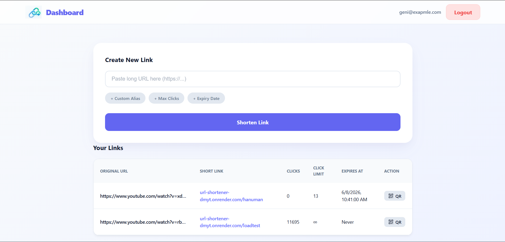

# URL Shortener

**Live Demo:** [View Application](https://url-shortener-phi-vert.vercel.app/login) | **Backend API:** [Deployed on Render](https://url-shortener-dmyt.onrender.com)

A full-stack, production-ready URL shortener engineered to handle high-volume read traffic. Designed with real-world system design principles, featuring distributed caching, sliding-window rate limiting, and robust analytics.



---

## ✨ Features

- [x] **Secure Authentication** — JWT-based login and registration
- [x] **Advanced Link Generation** — Supports auto-generated Base62 codes or custom aliases
- [x] **Link Expiration & Limits** — Set time-based expiry dates or maximum click thresholds
- [x] **QR Code Generation** — Server-side Base64 QR code rendering for seamless physical-to-digital routing
- [x] **High-Performance Caching** — Upstash Redis implementation using the Cache-Aside pattern for sub-millisecond reads
- [x] **Sliding-Window Rate Limiting** — Redis-backed rate limiter protecting endpoints from abuse (100 req/hr for Auth, 10 req/hr for Anonymous)
- [x] **Enterprise Observability** — Global error handling and `X-Request-ID` tracing injected into Morgan/Winston logs
- [x] **Automated Maintenance** — `node-cron` background jobs to sweep and permanently delete expired links
- [ ] *Future: Distributed ID Generation (Snowflake-style) & Message Queues (Kafka) for async analytics*

---

## 🏗 Architecture


The system follows a highly scalable **4-Tier Architecture**:

| Tier | Technology | Hosting |
| :--- | :--- | :--- |
| **Client Layer** | React / Vite | Vercel |
| **Application Layer** | Node.js / Express | Render |
| **Cache Layer** | Upstash Redis | Upstash (Managed) |
| **Database Layer** | Neon PostgreSQL | Neon (Managed) |

---

## 📊 Performance Benchmarks

Load testing was conducted using [k6](https://k6.io/) to simulate traffic spikes and measure system resilience. The test bypassed destination redirects to isolate and stress-test the internal infrastructure.

**Test Configuration:**
- **Virtual Users (VUs):** 100 Concurrent
- **Duration:** 60 Seconds
- **Target Scenario:** Cache-Hit Redirect (Redis)
- **Environment:** Free-tier cloud infrastructure tested from India to US/EU region

| Metric | Value | Notes |
| :--- | :--- | :--- |
| **Total Requests** | 4,123 | Total redirects successfully processed |
| **Throughput** | ~67 req/s | Equivalent to ~5.8 Million requests/day |
| **Error Rate** | 0.00% | Zero dropped connections under heavy concurrency |
| **p95 Latency** | 563.81 ms | Tight variance (~120ms delta from median) proves Redis cache successfully prevented DB bottlenecking *(base latency bound by physical geography)* |

---

## 🔌 API Documentation

Every response includes an `X-Request-ID` header for distributed tracing. Errors follow a consistent `{ "error": string, "code": string }` format.

### 1. Create Short URL

- **Endpoint:** `POST /api/shorten`
- **Auth Required:** Yes
- **Rate Limit:** 100 requests / hour

**Request Body:**
```json
{
  "originalUrl": "https://www.youtube.com/watch?v=dQw4w9WgXcQ",
  "customAlias": "rickroll",
  "maxClicks": 100,
  "expiresAt": "2026-12-31T23:59:00Z"
}
```

**Success Response `201 Created`:**
```json
{
  "message": "URL shortened successfully",
  "shortCode": "rickroll",
  "shortUrl": "https://url-shortener-dmyt.onrender.com/rickroll"
}
```

---

### 2. Generate QR Code

- **Endpoint:** `GET /api/qr/:shortCode`
- **Auth Required:** No

**Success Response `200 OK`:**
```json
{
  "qrCode": "data:image/png;base64,iVBORw0KGgoAAAANSUhEUgAAASwAAAEsCAYAAAB5..."
}
```

---

### 3. Redirect to Original URL

- **Endpoint:** `GET /:shortCode`
- **Auth Required:** No
- **Success Response:** `302 Found` — Redirects to `originalUrl`
- **Error Response:** `410 Gone` — Serves an HTML page if the link is expired or click limit is reached

---

## 🛠 Tech Stack

| Layer | Technologies |
| :--- | :--- |
| **Frontend** | React, Vite, Axios, React Router |
| **Backend** | Node.js, Express.js, `qrcode`, `node-cron` |
| **Database** | PostgreSQL (Neon) |
| **Cache** | Redis (Upstash) |
| **Security** | Helmet, CORS, JWT |
| **Testing** | k6 (Load Testing) |
| **Logging** | Winston, Morgan |

---

## 🚀 Quick Start (Docker Setup)

**1. Clone the Repository**
```bash
git clone https://github.com/YOUR_USERNAME/url-shortener.git
cd url-shortener
```

**2. Configure Environment Variables**

Create a file at `backend/.env`:
```env
PORT=3000
DB_USER=postgres
DB_PASSWORD=mysecretpassword
DB_HOST=postgres
DB_PORT=5432
DB_NAME=url_shortener
JWT_SECRET=super_secret_jwt_key_123
REDIS_URL=redis://redis:6379
```

**3. Start the System**
```bash
docker-compose up --build
```

- Frontend: http://localhost:5173
- Backend: http://localhost:3000
